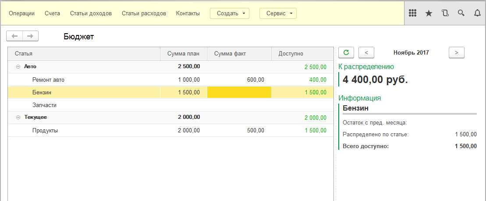
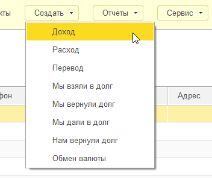

# "Мои деньги" - конфигурация на платформе 1С 8.3

Почему не "1С Деньги": малофункциональный бюджет, неудобный учет долгов, нет учета коммунальных и т.п. расходов.

Основное задача этой разработки - предоставить удобный инструмент планирования расходов, не ограничиваясь учетом текущих расходов и накоплением чеков. Также вести удобный учет коммунальных платежей без "тетрадки". В планах - еще и связь с банками по платежам и загрузкой расходов.

Стадия: пре-альфа (очень много запланировано и тестирование не на первом плане, однако сам учет веду только в этой конфигурации).

Из реализованного:

- Ведение учета доходов, расходов, долгов, внутренних перемещений денег
- Справочники Статьи доходов, Статьи расходов, Контакты
- Справочник Валюты
- Универсальный документ "Операция"
- Отчет о доходах и расходах за период
- Обработка "Бюджет" в режиме главного экрана
- Загрузка выписок из мобильного приложения ["Проверка кассового чека"](https://play.google.com/store/apps/details?id=ru.fns.billchecker)
- Обмен данными с мобильным приложением ["FinPix учет расходов и сканер чеков"](https://play.google.com/store/apps/details?id=com.finpix.app) - пока только загрузка в 1С, полный обмен будет позже.
 
Скриншоты:

# Контакты

Если разработка вас заинтересовала, пишите пожелания/замечания в issues, либо:\
e-mail: [igor@fokusov.com](mailto:igor@fokusov.com) \
telegram: [@ighar](https://t.me/ighar)